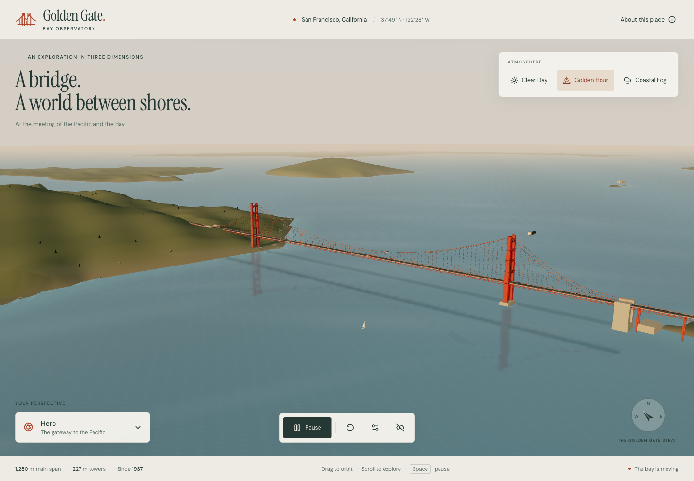

# Golden Gate — Bay Observatory

An interactive 3D exploration of the Golden Gate Bridge and San Francisco Bay, with animated water, traffic, boats, and coastal fog.

[Open the observatory](https://hostlife22.github.io/js/) · [Reference study](docs/REFERENCE_STUDY.md) · [Validation](docs/VALIDATION.md) · [Visual review](docs/VISUAL_REVIEW.md)



Seven perspectives, three atmospheric presets, a shared simulation clock, reflective procedural water, instanced traffic, and deterministic coastal terrain. Built with Vite, React, strict TypeScript, Three.js, React Three Fiber, and Drei. Everything needed to render the scene is local; no backend, map service, API key, CDN font, or live traffic feed is required.

## Run locally

Use Node.js 22.12 or newer (Node 22 is used in CI), npm, and a WebGL 2 browser.

```sh
npm ci
npm run dev
```

Development opens at `http://127.0.0.1:5173/`. To inspect the static production build:

```sh
npm run build
npm run preview
```

Open `http://127.0.0.1:4173/js/`. The `/js/` base matches the actual GitHub repository, `Hostlife22/js`, whose default branch is `main`.

## Explore

| Action                               | Control                                                 |
| ------------------------------------ | ------------------------------------------------------- |
| Rotate                               | Drag with mouse or one finger                           |
| Zoom                                 | Wheel or pinch                                          |
| Pan                                  | Right drag; two fingers; arrow keys with canvas focused |
| Pause all scene animation            | Space or Play/Pause                                     |
| Return to Hero                       | R or Reset View                                         |
| Hide/restore controls                | H or Hide Interface                                     |
| Change view, weather, haze, or speed | On-screen controls                                      |

Manual camera input cancels a preset flight. Pausing freezes the water, traffic, ships, wakes, and atmosphere while leaving the camera and weather controls usable. Reduced-motion users start paused and receive immediate preset camera changes.

## Commands

| Command                           | Purpose                                        |
| --------------------------------- | ---------------------------------------------- |
| `npm run dev`                     | Local development                              |
| `npm run build`                   | Strict typecheck and production bundle         |
| `npm run preview`                 | Serve the production bundle                    |
| `npm run format` / `format:check` | Prettier                                       |
| `npm run lint`                    | ESLint                                         |
| `npm run typecheck`               | Strict TypeScript                              |
| `npm test`                        | Vitest geometry and simulation checks          |
| `npm run test:e2e`                | Playwright against the production bundle       |
| `npm run check`                   | Formatting, lint, types, unit tests, and build |

Install the browser once with `npx playwright install chromium`. E2E tests are excluded from `check`. CI runs fast checks on pushes to `main` and pull requests; Pages deploys the same checked commit after successful CI. Browser checks have a separate **workflow_dispatch-only** workflow.

For screenshots, video, and frame measurements, run `node scripts/capture.mjs` with preview running. Set `OBSERVATORY_URL` to inspect a deployed copy. On macOS the validation scripts enable ANGLE Metal; other platforms use Chromium's default renderer. The diagnostics endpoint is opt-in through `?diagnostics=1`. `?forceFallback=1` exercises the browser capability fallback.

## Fidelity and credits

Bridge spans, tower height, deck width, and cable diameter use Golden Gate Bridge District data. The scene uses true north, uniform scale (one unit is ten metres), and projected geographic positions. Coastlines are generalized Natural Earth data, not a surveyed local shoreline. Terrain elevations, building blocks, tower plate details, the Alcatraz perimeter, weather, and movement are illustrative. Ships follow verified open-water demonstration routes; vehicles use three fixed lanes each way. This does not reproduce current shipping or reversible-lane operations.

Reflections use a separate bridge proxy at bounded resolution and exclude the city, foliage, vehicles, and ships. Spatial coastal fog uses low world-space layers plus distance haze. See [architecture](docs/ARCHITECTURE.md) and [visual review](docs/VISUAL_REVIEW.md) for the practical limits.

Code: MIT © hostlife22. Natural Earth: public domain. Bridge alignment: © OpenStreetMap contributors, ODbL. Local DM Sans and Instrument Serif: SIL Open Font License 1.1. Full asset attribution and sources are in [THIRD_PARTY_LICENSES.md](docs/THIRD_PARTY_LICENSES.md).
